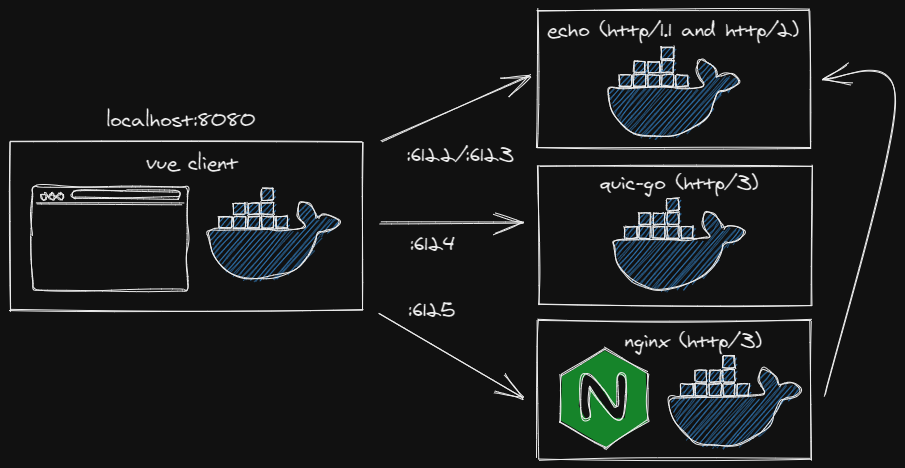

### Go HTTP versions comparison

Repository that exposes services in HTTP/1.1, HTTP/2 and HTTP/3 (new QUIC protocol) made in Go.



#### Usage

```docker-compose up -d
docker-compose up -d
```

After all container start go to the client by browsing `http://localhost:8080`.

#### Notes

QUIC is still an experimental protocol and to allow requests to services that are using it you need to enable QUIC in your browser. QUIC is supported in most major browsers including Firefox and Chrome. 

For Firefox go to `about:config` and toggle `network.http.http3.enabled` and increase `network.http.http3.recvBufferSize` to `2500000`.

For Chrome go to `chrome://flags ` and toggle `Experimental QUIC protocol`.